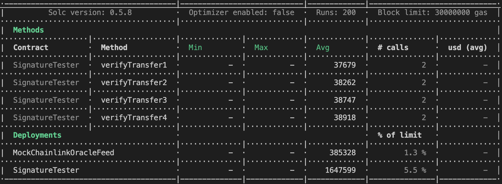

## wrote 4 functions in ```SignatureTester.sol```
## **All functions receive a `data` param that needs to contain a signature and the set of data you are signing which also needs to be decoded in order to perform the ECDSA recover()**

# VerifyTransfer1 : takes _data with 4 params
# VerifyTransfer2 : takes _data with 5 params
# VerifyTransfer3 : takes _data with 6 params
# VerifyTransfer4 : takes _data with 7 params
